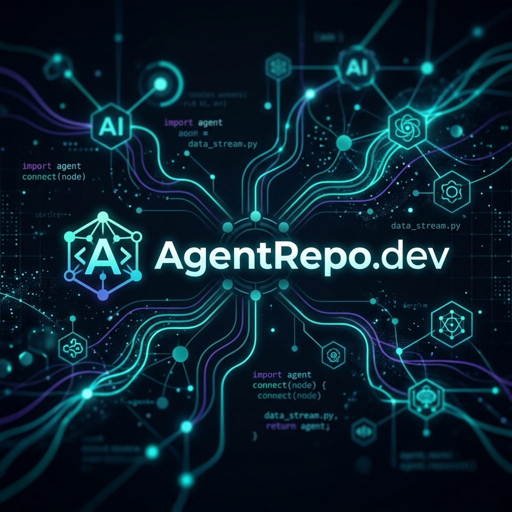

<p align="center">
  
</p>

<p align="center">
  <a href="https://github.com/luisobz/agentrepo.dev/blob/main/LICENSE">
    
  </a>
  
  
  
</p>

---

# 🤖 AgentRepo.dev

**AgentRepo.dev** es un hub de código abierto moderno y escalable diseñado para gestionar, versionar y desplegar **Agentes de IA** y **Habilidades (Skills)** reutilizables. 

Construido bajo los principios de **Arquitectura Hexagonal (DDD)**, este monorepo combina la solidez de **NestJS** en el backend, la agilidad de **Next.js** y **tRPC** en el frontend, y la potencia de **DeepSeek** para orquestar flujos de trabajo inteligentes.

---

## ✨ Características Principales

*   **🧩 Catálogo de Habilidades (Skills):** Prompts, sistemas, configuraciones y plantillas markdown editables en tiempo real con integración de Monaco Editor.
*   **🤖 Hub de Agentes:** Modelado completo de agentes de IA con árboles de directorios interactivos, gestión de versiones e IDE integrado.
*   **🔮 Playground de Agentes:** Entorno interactivo para probar el comportamiento de los agentes con control fino de tokens y trazabilidad.
*   **🔗 Flujos de Trabajo Avanzados:** Integración fluida con **DeepSeek** y **LangChain** para generar contenido, enviar correos a través de SMTP seguro y generar reportes en PDF dinámicos.
*   **🛡️ Arquitectura Ultra-Limpia:** Separación estricta de responsabilidades (Hexagonal / Domain-Driven Design) para una mantenibilidad y testing sin esfuerzo.
*   **🎨 Diseño Premium:** Sistema de diseño de alta fidelidad basado en CSS dinámico, animaciones fluidas, modo oscuro nativo, avatares interactivos y componentes premium basados en Radix/shadcn.

---

## 🏛️ Estructura del Monorepo

Este proyecto utiliza **Nx** para gestionar de forma eficiente sus aplicaciones y paquetes:

```mermaid
graph TD
    subgraph Apps (Frontend & API)
        web[Next.js Public Web App]
        admin[Next.js Admin Panel]
        api_web[NestJS Main API & tRPC]
        api_ai[NestJS AI Workflows API]
    end

    subgraph Shared Packages
        trpc[tRPC Router & Schemas]
        ui[Shared UI Design System]
        config[Global Configurations]
        app[packages/application - Use Cases & Ports]
        domain[packages/domain - Pure Business Logic]
        infra[packages/infrastructure - DB Adapters & SMTP]
    end

    web --> trpc
    admin --> trpc
    trpc --> api_web
    api_web --> app
    api_ai --> app
    app --> domain
    app --> infra
    infra --> db[(PostgreSQL / Prisma)]
```

### Aplicaciones (`apps/`)
*   `web`: Aplicación web pública e interactiva construida en Next.js.
*   `admin`: Panel de control de Next.js para la administración del catálogo de habilidades y agentes.
*   `backend-web`: API principal en NestJS que expone el backend y maneja las solicitudes tRPC.
*   `backend-ai`: API especializada en NestJS enfocada exclusivamente en flujos de trabajo y procesamiento de Inteligencia Artificial.

### Paquetes (`packages/`)
*   `domain`: Entidades puras y reglas de negocio globales (sin dependencias externas).
*   `application`: Casos de uso de la aplicación y puertos de la arquitectura hexagonal.
*   `infrastructure`: Adaptadores de persistencia (Prisma DB) y servicios externos (SMTP, R2, AI clients).
*   `trpc`: Enrutadores compartidos y esquemas de validación para una comunicación segura tipo-a-tipo.
*   `ui`: Sistema de diseño modular y componentes interactivos reutilizables con Tailwind CSS.
*   `config`: Tokens de configuración compartidos del monorepo.

---

## 🚀 Inicio Rápido (Desarrollo Local)

### 📋 Requisitos Previos

Asegúrate de tener instalados los siguientes componentes:
*   **Node.js** v26.1.0 o superior
*   **pnpm** v10.33.4 o superior
*   **Docker** y **Docker Compose** (para la base de datos local)

---

### ⚙️ Instalación y Configuración

1. **Clonar el repositorio:**
   ```bash
   git clone https://github.com/tu-usuario/agentrepo.dev.git
   cd agentrepo.dev
   ```

2. **Instalar dependencias:**
   ```bash
   pnpm install
   ```

3. **Configurar variables de entorno:**
   Copia el archivo `.env.example` para crear tu entorno local y rellena las credenciales correspondientes:
   ```bash
   cp .env.example .env
   ```

4. **Levantar la base de datos local:**
   Ejecuta el script automático para levantar el contenedor PostgreSQL de Docker, generar el cliente de Prisma y ejecutar las migraciones:
   ```bash
   pnpm db:up
   ```
   *(Alternativamente, puedes usar `./scripts/db-up.sh`)*

5. **Iniciar el entorno de desarrollo:**
   Ejecuta todos los servidores de desarrollo en paralelo con Nx:
   ```bash
   pnpm dev
   ```

---

## 🛠️ Tecnologías Utilizadas

*   **Frameworks:** Next.js 15, NestJS 11, Fastify
*   **Bases de Datos & ORM:** PostgreSQL, Prisma Client
*   **API & Comunicación:** tRPC, React Query
*   **IA & Observabilidad:** LangChain, DeepSeek API, Langfuse
*   **Estilos & Componentes:** Tailwind CSS, Radix UI, Framer Motion
*   **Herramientas de Build:** Nx, SWC, TypeScript, Prettier, Vitest

---

## 🔒 Seguridad e Integridad

Para asegurar que el proyecto se mantiene limpio y sin vulnerabilidades:
*   **Secretos:** Nunca subas claves API directas. Usa siempre `.env` y el módulo de configuración.
*   **Arquitectura:** Las capas internas (`packages/domain`) nunca deben importar paquetes de infraestructura.
*   **Código Limpio:** Sigue rigurosamente las pautas establecidas en `skills/clean-code.md`.

---

## 📄 Licencia

Este proyecto está licenciado bajo la **Licencia GNU Affero General Public License v3 (AGPL-3.0)**. Para más detalles, consulta el archivo [LICENSE](LICENSE).
